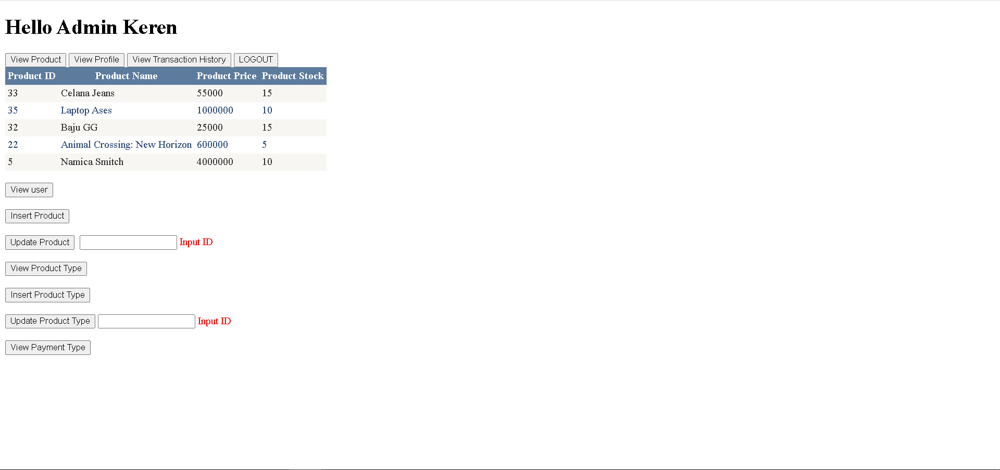
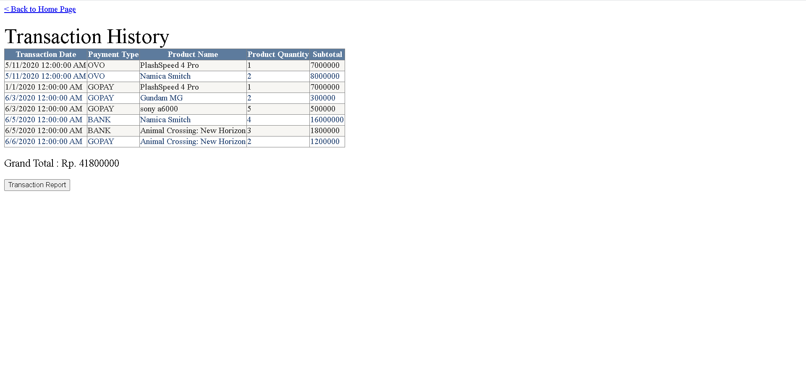

# TokoBedia Website(2)
This is my school project in Pattern Software Design(or Domain Driven Design) Laboratory Subjects. This is a group project that consists of 3 people.  
This is a follow-up project from the individual project and now done in groups.  
This website is about E-Commerce Website.

## Descriptions
This project is made on May 27, 2020 during 4th semester in university.  
The purpose of this project is to implement Domain Driven Design in the project, so there will be a view, controller, handler, repository, and factory folder.  
Because this is a follow-up project, we can use the previous project and develop it. We decided the previous project used here was the individual project of my friend which was one group with me so we developed it.  
I coded the Add to Cart page, Insert Data to Cart Database code, Transaction History, and Transaction Report.  

## Run Guide
Please run it from <b>Home.aspx</b> in view folder.  

## Project's Image Overview
First Image :

 
Second Image :

## Technologies
▸ C# 
▸ ASP.NET 
▸ Visual Studio 2015 
